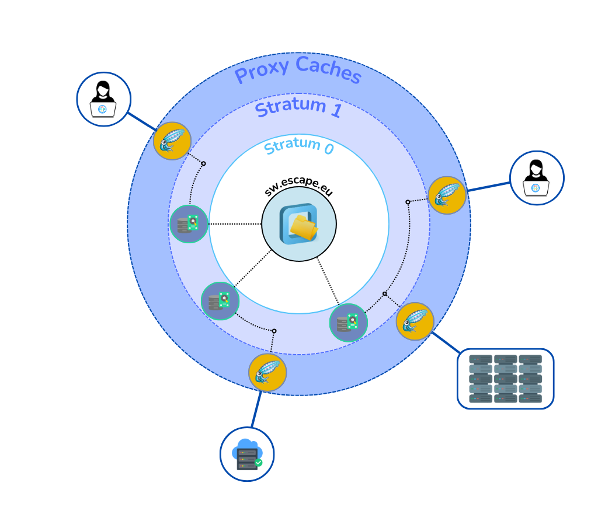

# The ESCAPE CVMFS repository

The [CERN Virtual Machine File System](https://cernvm.cern.ch/fs/) (CVMFS) is a read-only, HTTP-based file system optimized for distributing scientific software at scale.
Originally developed at CERN for the Worldwide LHC Computing Grid (WLCG), CVMFS is now widely adopted across many research infrastructures. 
Among other capabilities, CVMFS provides the following functionalities:

- **Global software delivery system**: Software is published once and instantly becomes available across all connected clients and compute sites.

- **HTTP and caching-based**: CVMFS fetches files over standard HTTP and relies on [caching proxies](https://www.squid-cache.org/) to reduce load and latency.

- **FUSE-mounted**: Software appears as a regular local file system on the client machine.

Find more at [the official CVMFS documentation](https://cvmfs.readthedocs.io/en/stable/).
### Components
The ESCAPE CVMFS infrastructure consists of three main components: 
1. The single source, called the Stratum 0 Repository Server
2. Public mirrors, called Stratum 1 Replica Servers
3. Caches, usually managed by Squid Proxy servers

One protected read/write Stratum 0 instance, called `sw.escape.eu`, is feeding up the public, distributed mirror servers.  
Then, a distributed hierarchy of proxy servers fetches content from the closest public mirror server.

Find more details about `sw.escape.eu` and how to setup CVMFS in [the developer documentation](tech-docs/services/cvmfs).

A diagram of the infrastructure described is shown below.

## CVMFS the ESCAPE VRE

In the ESCAPE VRE, we use CVMFS to:

- Distribute pre-built scientific software and tools in a consistent, portable way across cloud, HPC, and local environments.

- Package domain-specific applications, such as Rucio clients or analysis environments, as tarballs that are extracted into CVMFS repositories.

- Ensure reproducibility by version-controlling software environments and decoupling runtime dependencies from local installations.

- Facilitate onboarding of new communities by removing the burden of local software setup and environment configuration.

This CVMFS-based software delivery system allows ESCAPE to scale up access to research tools, reduce setup time, and ensure consistency across diverse computing resources.