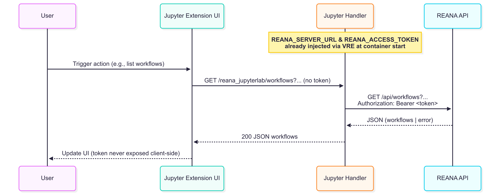

# Authentication

## Token Reuse

The REANA JupyterLab extension automatically reuses the existing JWT access token issued by the IdP, corresponding to the one that authenticated the current JupyterLab session. **No additional login or authentication steps are required** to start using REANA through the extension.

## Verifying Access

You can verify that authentication is working properly by:

1. Opening the REANA sidebar tab in JupyterLab
2. Checking if you can see your workflows listed
3. Opening a workflow detail panel to see its contents

If these actions succeed, your authentication is working correctly. If you see "unauthorized" errors or empty lists where you expect content, there may be an authentication issue.

## Troubleshooting

If you encounter authentication problems:

- **Token expired?** Restart your JupyterLab container to get a fresh token
- **Still not working?** Re-login to the VRE web interface, then launch a new JupyterLab session
- **Need different credentials?** Use the connection configuration panel (see below)

## Optional Connection Configuration

You can still manually configure the connection to a different REANA instance by:

1. Opening the REANA sidebar tab
2. Clicking on the connection settings icon
3. Entering a custom server URL and access token

This is useful if you need to connect to a different REANA instance than the default one configured for VRE.

## Authentication Flow

*Authentication flow: Your VRE login generates a token that is automatically injected into your container environment and configuration, allowing the extension to access REANA resources on your behalf.*
