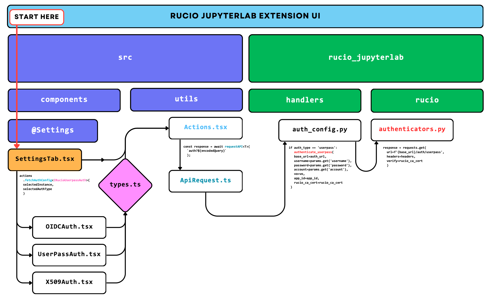

# Authentication workflow

The following files are responsible for the authentication workflow:

```
.
├── rucio_jupyterlab
│   ├── handlers
│   │   ├── auth_config.py
│   │   ├── handlers.py
│   ├── rucio
│   │   ├── authenticators.py
├── src
│   ├── components
│   │   ├── @Settings
│   │   │   ├── OIDCAuth.tsx
│   │   │   ├── SettingsTab.tsx
│   │   │   ├── UserPassAuth.tsx
│   │   │   ├── X509Auth.tsx
│   │   │   └── X509ProxyAuth.tsx
│   ├── types.ts
│   ├── utils
│   │   ├── Actions.tsx
│   │   ├── ApiRequest.ts
```
Below is an example of the authentication workflow:



---

:::tip[Improving credentials validation]
Please look at: [jupyterlab-extension!71](https://github.com/rucio/jupyterlab-extension/pull/71)
```
Validation and authentication improvements, logging enhancements:

    - Refactoring of the request URL construction in the API request function.
    - Addition of OIDC token validation with related UI and API handling.
    - Improved logging and error handling in authentication and handler modules.

```
:::