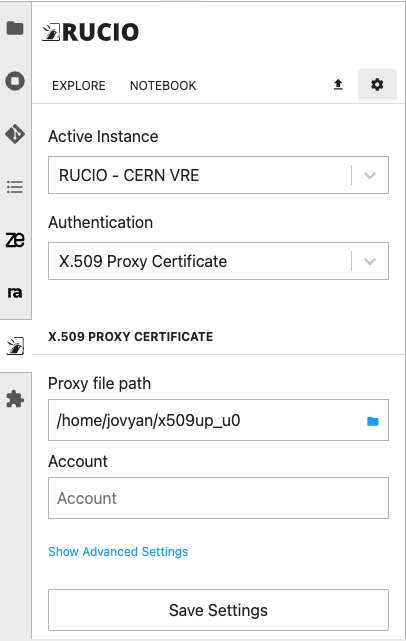

# CERN VRE Rucio JupyterLab extension configuration

The Rucio JupyterLab extension is installed in most of the CERN VRE environments and allows any VRE user to access, explore and trigger replicas within the ESCAPE Data Lake content. 

## Default Authentication - `OIDC` tokens

By default the extension is configured to use the `OIDC` tokens as default authentication type. 

Whenever a user logs into the VRE, the `JupyterHub` deployment exchanges an access token with the the ESCAPE INDIGO IAM service, authenticating the user to the ESCAPE Rucio instance.

This means that the user does not need re-authenticate when landing in the JupyterLab environment and can start using the Rucio JupyterLab extension and/or the interact with Rucio via the CLI.

:::tip

Check that the authentication has happened successfuly by opening a `Terminal` window and typing 
```bash=
rucio whoami
```

:::

:::info

ESCAPE OIDC access tokens have been configured with a lifetime of 2 hours. 

If you think that your Jupyter session has been opened for more than 2h, or you cannot further access the Rucio instance, please close and restart your session by clicking on the `File` tab:

`File` > `Hub Control Panel` > `Stop My Server` > `Start My Server`.

:::

## Authenticate via `x509` Proxy certificates 

The Rucio JupyterLab extension also allows `x509` certificates to authenticate to the ESCAPE Rucio instance. The first thing you will need to do is setup the proper access permission on the certificate and key, and then run the `voms-proxy-init` command to create a valid proxy.

```
chmod 644 ~/.globus/usercert.pem
chmod 400 ~/.globus/userkey.pem

voms-proxy-init --cert ~/.globus/usercert.pem --key ~/.globus/userkey.pem --voms escape -out <OUTPUT_FILENAME_AND_PATH> 
```
:::warning[INFO]
To run the `voms-proxy-init` command you must first upload your `userkey.pem` and `usercet.pem` to your Jupyter session.
You can upload these files using  the `Upload Files` icon on the File Browser tab of the JupyterLab session.
:::

To configure the extension to use `x509` Proxy certificates :

1. Access the VRE and open the Rucio JupyterLab tab.
2. Click on the settings icon (⚙️), on the right of the `Explore` and `Notebook` tabs.
3. Use the different dropdown menus to select the `Authentication` method and select the `X.509 Proxy Certificate`.
4. Chose the path to the proxy in the `Proxy file path` field. 
5. Add your Rucio account in the `Account` field.
6. Click on the `Save Settings`, change to the `Explore` tab and start using the extension.

<p align="center">
    
</p>

:::tip

You can click on the `Show Advance Setting` and `Purge Cache` to erase any saved configuration in case the extension shows the followin message:
```bash=
Authentication error. Perhaps you set an invalid credential?
```

:::