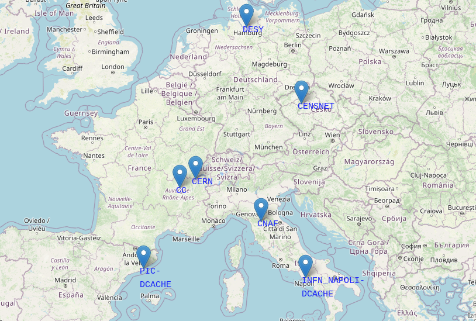

# The Rucio Data Lake 

The Data Lake infrastructure is made up of distributed Storge Elements adn of a reliable framework to upload and transfer data between them. 
An overview of the available Rucio Storage Elements (RSEs) can be foudn in the [Grafana monitoring dashboard](https://monit-grafana-open.cern.ch/d/PJ65OqBVz/vre-rucio-events?orgId=16), which are useful to inspect the RSE transfer details. 


If you do not have access to the dashboard, register with a CERN SSO account, please get in touch through the **[Slack channel](https://eosc-escape.slack.com/archives/C03Q65M1U5V)**.
The location of the storage elements, which are provided and maintained by European partner institutions, is shown on the map. 



This guide takes a look at how to install the Rucio client environment in two different ways. 

1. Installing the required packages on your local machine
2. Using a Docker container. Docker technologies mitigate dependency and platform specific issues, and are therefore recommended; however, if you want to upload large data that are present on your system, you will need to copy them inside the Docker container, and then upload them on the Rucio DataLake. This might be cumbersome, especially if you are dealing with large files. 


In general, there are two main ways to authenticate to the Rucio instance: via X509 certificates and via OIDC tokens. These two ways require different configuration files for Rucio. 

### X509 Rucio configuration 

The X509 certificate is placed in the `.globus/` directory. 
The `rucio.cfg` file is usually place in the `/opt/rucio/etc/` directory. 

```console
[client]
rucio_host = https://vre-rucio.cern.ch
auth_host = https://vre-rucio-auth.cern.ch
ca_cert = /etc/pki/tls/certs/CERN-bundle.pem
auth_type = x509_proxy
account = <myrucioaccount>
client_cert = .globus/usercert.pem
client_key = .globus/userkey.pem
client_x509_proxy = /tmp/x509up_u0 #(or check where the voms-proxy-init command saves the proxy file!)

[policy]
permission = escape 
schema = escape  
lfn2pfn_algorithm_default = hash 
support = https://github.com/rucio/rucio/issues/
support_rucio = https://github.com/rucio/rucio/issues/
```

### OIDC token Rucio configuration 

The `rucio.cfg` file is usually place in the `/opt/rucio/etc/` directory. 

```console
[client]
rucio_host = https://vre-rucio.cern.ch
auth_host = https://vre-rucio-auth.cern.ch
ca_cert = /etc/pki/tls/certs/CERN-bundle.pem
auth_type = oidc
account = <myrucioaccount>
oidc_audience = rucio
oidc_scope = openid profile offline_access wlcg wlcg.groups fts:submit-transfer
request_retries = 3
oidc_issuer = escape
oidc_polling = true
auth_oidc_refresh_activate = true

[policy]
permission = escape 
schema = escape  
lfn2pfn_algorithm_default = hash 
```

## 1. Manual installation 

We assume you are running the commands from a CentOS Linux distribution, in our case a `CS8 - x86_64` image. Run the commands int he following order:

```console
yum install -y epel-release.noarch && \
    yum clean all && \
    rm -rf /var/cache/yum
    
yum upgrade -y && \
    yum clean all && \
    rm -rf /var/cache/yum
    
yum -y install wget gfal2*

yum -y install https://repo.ius.io/ius-release-el7.rpm && \
    yum install -y voms-clients-java gfal2-all gfal2-util python3-gfal2 xrootd-client\
                   nordugrid-arc-client nordugrid-arc-plugins-gfal \
                   nordugrid-arc-plugins-globus nordugrid-arc-plugins-s3 \
                   nordugrid-arc-plugins-xrootd && \
    yum clean all && \
    rm -rf /var/cache/yum

```
Then, install the certificates for the VOMS validation:


```console
curl -Lo /etc/yum.repos.d/EGI-trustanchors.repo https://repository.egi.eu/sw/production/cas/1/current/repo-files/EGI-trustanchors.repo && yum -y update && yum -y install ca-certificates ca-policy-egi-core fetch-crl && yum clean all && rm -rf /var/cache/yum

curl -Lo /etc/pki/tls/certs/CERN-bundle.pem https://gitlab.cern.ch/plove/rucio/-/raw/7121c7200257a4c537b56ce6e7e438f0b35c6e48/etc/web/CERN-bundle.pem

mkdir -p /etc/vomses \
    && wget https://indigo-iam.github.io/escape-docs/voms-config/voms-escape.cloud.cnaf.infn.it.vomses -O /etc/vomses/voms-escape.cloud.cnaf.infn.it.vomses
mkdir -p /etc/grid-security/vomsdir/escape \
    && wget https://indigo-iam.github.io/escape-docs/voms-config/voms-escape.cloud.cnaf.infn.it.lsc -O /etc/grid-security/vomsdir/escape/voms-escape.cloud.cnaf.infn.it.lsc
```

Next, you need the python rucio-client. We suggest to do this in a fresh virtual environment. 

```console
# Latest version of Rucio 
export RUCIO_LATEST=1.30.0

python3 -m pip install --user virtualenv
python3 -m venv rucio --system-site-packages
source rucio/bin/activate
python3.6 -m pip install --no-cache-dir --upgrade pip && \
python3.6 -m pip install  --no-cache-dir --upgrade setuptools && \
python3.6 -m pip install --no-cache-dir --pre rucio-clients==${RUCIO_LATEST} && \
python3.6 -m pip install --no-cache-dir jinja2 j2cli pyyaml
```   
Have your `rucio.cfg` file ready in `/opt/rucio/etc/` and run:
```console
export RUCIO_CONFIG=/opt/rucio/etc/rucio.cfg
```
If you use X509 verification, you will alo need the command: 

```console
voms-proxy-init --voms escape --cert .globus/usercert.pem --key .globus/userkey.pem 
```
Otherwise, if you use tokens, you are good to go. 

By typing in the terminal:

```console
$ rucio whoami
```
You should see your username being recognised. If it is your first time using tokens, you will be redirected to a link starting with  'https://escape-rucio-auth.cern.ch/auth/...', click on it and choose the duration of your token. You should be all set up to run your rucio commands!

## 2. Docker image installation 

Docker needs to be installed following the [Docker installation](https://docs.docker.com/get-docker/) instructions. The procedure will change depending on your operating system. 
The Docker file will extend the Rucio image and will enable the user to interact with the Data Lake. Further information can be found [here](https://github.com/cern-vre/containers/tree/main/rucio-client). 
The Docker image for this project can be pulled with:

```console
$ docker pull ghcr.io/vre-hub/vre-rucio-client:latest
```
The image is hosted [here](https://github.com/cern-vre/containers/tree/main/rucio-client).

A default Rucio `/opt/rucio/etc/rucio.cfg` file is incorporated into the image and supplied to the container when it is run. The values from this default can be partially or fully overridden by either specifying parameters as environment variables or by mounting a bespoke configuration file. 

Note that if you are uploading data from the host machine where the Docker container is running, you will need to bind that directory as a volume mount for it to be accessible inside the container.


The -v option is a volume mount, which mounts your certificates from your local directory into the docker container. 
Make sure to specify the correct origin folder for the certificates, otherwise the command will generate an empty directory inside the container!

To see whether you initialized the Docker container correctly, refer to the [Docker documentation](https://docs.docker.com/get-started/). For example, you could run: 

```console
$ docker ps -a
```
The command should show the `rucio-client` container running. 

### Run with X.509 authentication

Have your certificate ready and divided into two files named ~/.globus/userkey.pem and ~/.globus/usercert.pem. 

```bash
docker run --user root -e RUCIO_CFG_CLIENT_X509_PROXY=/tmp/x509up -e RUCIO_CFG_AUTH_TYPE=x509_proxy -e RUCIO_CFG_ACCOUNT=<myrucioname> -v ~/.globus/usercert.pem:/opt/rucio/etc/client.crt -v /.globus/userkey.pem:/opt/rucio/etc/client.key -it --name=rucio-client ghcr.io/vre-hub/vre-rucio-client
```
Take the `--user root` option away if you encounter problems.
If you cannot log in as root and you get permission errors, add your user account to the docker group:

```console
$ sudo groupadd docker
$ sudo gpasswd -a $USER docker
```
Sometimes you will still need to give the /var/run/docker.sock socket and /var/run/docker directory the proper permissions to make it work:

```console
$ sudo chown root:docker /var/run/docker.sock
$ sudo chown -R root:docker /var/run/docker
```

Once you are inside the container, generate the proxy:

```
$ voms-proxy-init --voms escape --cert /opt/rucio/etc/client.crt --key /opt/rucio/etc/client.key --out /tmp/x509up --debug
```
**Without the above command you will not be abel to execute uploads and downloads!**

After having run it, run `rucio whoami` to check you are authenticated against the server. 

## Run with token authentication
You only need to run the container specifying that you want to be authenticated with tokens. You will need to click on a link that authenticates you against the server and you are set to go. 

```
docker run --user root -e RUCIO_CFG_AUTH_TYPE=oidc -e RUCIO_CFG_ACCOUNT=<myrucioname> -it --name=rucio-client ghcr.io/vre-hub/vre-rucio-client
```
## Run with userpass authentication

```bash
$ docker run -e RUCIO_CFG_ACCOUNT=<myrucioaccount> -e RUCIO_CFG_AUTH_TYPE=userpass -e RUCIO_CFG_USERNAME=<myrucioname> -e RUCIO_CFG_PASSWORD=<myruciopassword> -it --name=rucio-client ghcr.io/vre-hub/vre-rucio-client
```

**General note:** To access the rucio-client Docker container in the future, always use this command from the machine where you have Docker installed:

```console
$ sudo docker exec -it rucio-client /bin/bash
```
Take a look at some [Rucio CLI Quickstart commands](https://docs.google.com/document/d/1LKJu56VMg7jkh19BtWoS3xSNYPf_kJN2xRKQrankfB8/edit#heading=h.avprao92dhlc) to get you familiarised with the main concepts. 

## Uploading data on the Data Lake

In order to uplaod data on the Data Lake, and supposing that you want to organise your data into data sets, you will need to choose an RSE (Rucio Storage Element), a Scope name and a Dataset name. 

The Scope name follows the formatting _Experiment_Institute_Project_ (e.g. ATLAS_LAPP_SP, the EOSC-Future Science Project)
The Dataset name follows the formatting _ProjectType.DataDescription.DataType_ (DM.LeptonResonance.Data20015_10TeV, the ProjectType for EOSC-Future is either DM or EU). 

You can list the current scopes with:

```
rucio list-scopes
```
The current ones are: 

|  SCOPE (_Experiment_Institute_Project_) | Description |
| ----------- | ----------- |
| **test**     | for the admins of the cluster       |
| **ET_OSB_MDC1**  |  _Einstein Telescope_Observational Science Board_Mock Data Challenge 1_    |
| **ATLAS_LAPP_SP**  |  _ATLAS_Laboratoire d'Annecy de Physique des Particules_MScienceProject_    |

To add a scope, you need to have administrator rights. If you don't have them, ask the system administrators to create a scope for you. 

```console
$ rucio-admin scope add --account=<your_IAM_account_name> --scope <Experiment_Institute_Project>
$ rucio-admin scope list
```
You can either upload single files, create a dataset, and attach the files to the dataset, or you can directly upload your folder (and the command will automatically create a dataset):

Example of how to upload single files:
```console
$ rucio upload --register-after-upload --scope ATLAS_LAPP_SP --rse EULAKE-1 DM.LeptonResonance.Data20015_10TeV.root
```
The `--register-after-upload` flag is important; if you omit it and the upload fails, you will not be able to use the same file name to upload it, you will have to rename it. 

Example of how to create a dataset:
```console
$ rucio add-dataset ATLAS_LAPP_SP:DM.LeptonResonance.Data20015_10TeV
```
Example of how to attach files to your dataset:
```console
$ rucio attach ATLAS_LAPP_SP:DM.LeptonResonance.Data20015_10TeV ATLAS_LAPP_SP:DM.LeptonResonance.Data20015_10TeV.root
```
Example of how to upload a whole file folder (cannot contain a folder within it):
```console
$ rucio -v upload --register-after-upload --rse EULAKE-1 --scope ATLAS_LAPP_SP --recursive ./folder_name/
```
To inspect all the datasets within a scope:
```console
$ rucio list-dids --filter 'type=all' ATLAS_LAPP_SP:*
```
To display changes of files within one dataset:
```console
$ rucio list-files ATLAS_LAPP_SP:DM.LeptonResonance.Data20015_10TeV
```
To see which rule protects your files:
```console
$ rucio list-rules --account=<your_account>
```
To delete the files, either set a --lifetime flag when you upload data, or delete the replication rules associated to the data (the expiration wil be set in 1 hr time):
```console
$ rucio delete-rule --purge-replicas --all rule_id
```
To add and look for metadata associated to a file or data set:
```console
$ rucio set-metadata --did ATLAS_LAPP_SP:DM.LeptonResonance.Data20015_10TeV --key KEY --value VALUE
$ rucio get-metadata --plugin JSON ATLAS_LAPP_SP:DM.LeptonResonance.Data20015_10TeV
$ rucio list-dids-extended --filter 'type=all' --filter 'KEY=VALUE' ATLAS_LAPP_SP:*
```
DO NOT use the value True or False for the _VALUE_ variable, as this will not be recognised by Rucio. 

You should keep in mind that the scope will not get deleted from the Rucio memory. 

You can visualize which data and rules are associated to your account by navigating to the [Rucio UI](https://vre-rucio-ui.cern.ch) platform. 

Have a look at the [rucio client documentation](https://rucio.readthedocs.io/en/latest/man/rucio.html) to perform more actions on your recently uploaded data. 
You can also upload your data in a more user-friendly way using the [DLaaS](dlaas.md###1. File Browser).   

<!-- 
## Rucio RESTful APIs    

Interacting with the client environment can be done through the Docker container, or through the RestAPI. This is a way for developers to be able to integrate any kind of scripts into the environment without the need of installing all the Rucio CLI dependencies.

#### *Token generation* 

Now that you have the VOMS in place, you will just need to add your token, which will expire and will be regenerated every hour, to your Rest API request. 
To get the token, run the command:

```console
$ curl -i --key ~/.globus/userkey.pem --cert ~/.globus/usercert.pem -H "X-Rucio-Account: <myrucioaccount>" -X GET https://escape-rucio-auth.cern.ch/auth/x509 | sed -n -e 's/^.*X-Rucio-Auth-Token: //p'
```
The \< myrucioaccount \> instance needs to be replaced with your Rucio UI account name, the same as your IAM account (but you can also find it by navigating [here](https://escape-rucio-webui.cern.ch/) and selecting the ‘Account management’ option under the Admin scroll-down menu). 

*Note: Using curl with the --insecure option allows curl to make insecure connections (i.e. curl does not verify the certificate), bypassing: curl: (60) SSL certificate problem: self signed certificate in certificate chain. Another solution is proposed [here](https://escape-rucio-webui.cern.ch/).*

Create a variable by copying the token which has been generated and running in the command line:

```console
$ token="<your_token>"
```
Do not forget the “ symbol. 

After the token has been saved, you can run any Rest Api command, for example listing all the available RSEs or all the scopes:

```console
$ curl -X GET -H "X-Rucio-Auth-Token: $token" https://escape-rucio.cern.ch/rses/
$ curl -X GET -H "X-Rucio-Auth-Token: $token" https://escape-rucio.cern.ch/scopes/
```

#### *Proxy generation*

The proxy generation with the x509 certificate works in the same way, the only difference is the command to get the token: 

```console
$ curl -i --key ~/.globus/userkey.pem --cert ~/.globus/usercert.pem -H "X-Rucio-Account: <myrucioaccount>" -X GET https://escape-rucio-auth.cern.ch/auth/x509_proxy | sed -n -e 's/^.*X-Rucio-Auth-Token: //p'
```
Again, using curl with the --insecure option might be useful. Follow the same steps as above to make Rest API requests. 

To find all the Rucio REST API commands, navigate [here](https://rucio.readthedocs.io/en/latest/rest.html).
 -->
