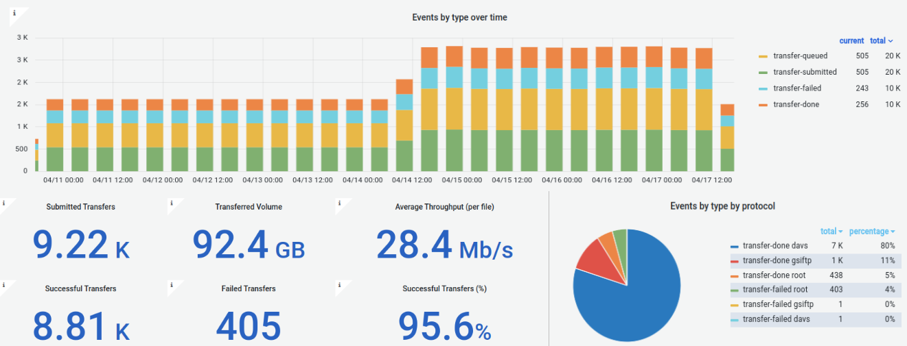
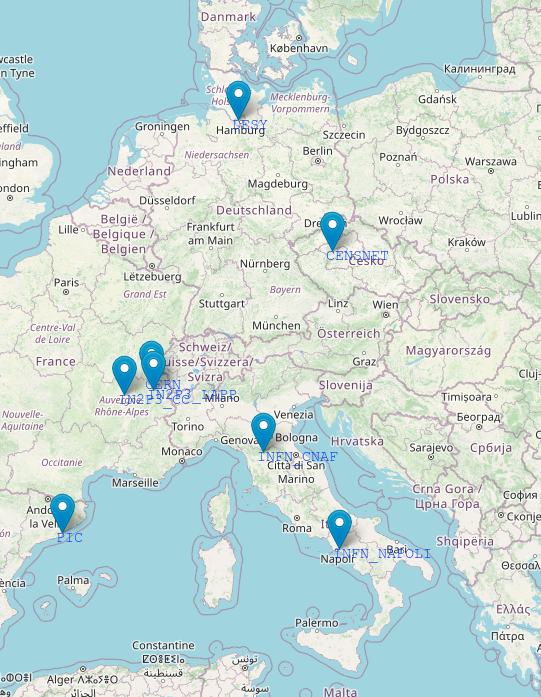

# The Rucio Data Lake 


The ESCAPE Data Lake infrastructure is made up of distributed Storage Elements and of a reliable framework to upload and transfer data between them. 
An overview of the available Rucio Storage Elements (RSEs) can be found in the [Grafana monitoring dashboard](https://monit-grafana-open.cern.ch/d/PJ65OqBVz/vre-rucio-events?orgId=16), which are useful to inspect the RSE transfer details. 



If you do not have access to the dashboard, login with a CERN account, or please get in touch through the **[Mattermost channel](https://mattermost.web.cern.ch/signup_user_complete/?id=zqaa9p5fqfd9bnnc64at4b5aye&md=link&sbr=su)**.
The location of the storage elements, which are provided and maintained by European partner institutions, is shown on the map, and a list of them is reported in the table. 

| _Rucio Storage Element (site-technology)_ | Location |
| ------------ | ----------- |
| **CC_DCACHE**  | Centre de Calcul, (IN2P3), Lyon, FR    |
| **CERN-EOSPILOT**  | European Organization for Nuclear Research, Meyrin, CH  |
| **CNAF-STORM**  |  Istituto Nazionale di Fisica Nucleare, Bologna, IT |
| **DESY-DCACHE**  | Deutsches Elektronen-Synchrotron, Hamburg, DE |
| **IN2P3_LAPP-DCACHE**  | Laboratoire d'Annecy de Physique des Particules (CNRS/IN2P3), Annecy, FR |
| **INFN_NAPOLI-DCACHE**  | Istituto Nazionale di Fisica Nucleare, Napoli, IT |
| **PIC-DCACHE**  |  Port d’Informació Científica, Barcelona, ES |
| **CESNET-S3**  |  Czech Education and Scientific NETwork, Prague, CZ  | 



## Interacting with the Rucio Data Lake

This section describes how to interact with the Rucio instance in two different ways. 

1. Installing the required packages on your local machine.
2. Using a Docker container. Docker technologies mitigate dependency and platform specific issues, and are therefore recommended; however, if you want to upload large data that are present on your system, you will need to copy them inside the Docker container, and then upload them on the Rucio Data Lake. This might be cumbersome, especially if you are dealing with large files.

In general, you will have to setup a Rucio configuration file that includes among others the user's identity and authentication method.

### The `rucio.cfg` configuration file

In general, there are two main ways to authenticate to the Rucio instance: X.509 certificates and OIDC tokens. These two ways require setting up a `rucio.cfg` file. 
This file is usually placed in the `/opt/rucio/etc/` directory, as the Rucio client looks at this location first by default.

:::tip[Pro Tip]
You can also change the default location of your `rucio.cfg` by doing
```bash
export RUCIO_CONFIG=<PATH/TO/FILE/rucio.cfg>
```
:::

Once you have ready you `rucio.cfg` file, and the sofware environment with the Rucio client (see next section), you can identify towards Rucio by doing a 
```bash
rucio whoami
```

If the authentication was successful, you will see a message with you Rucio user crendentials. Now you should be able to interact with the Rucio instance.

#### OIDC token Rucio authentication 

```yaml
# Example of rucio.cfg using OIDC token auth

[client]
rucio_host = https://vre-rucio.cern.ch
auth_host = https://vre-rucio-auth.cern.ch
ca_cert = /etc/pki/tls/certs/CERN-bundle.pem
auth_type = oidc
account = <MY_RUCIO_ACCOUNT>
oidc_audience = rucio
oidc_scope = openid profile offline_access 
request_retries = 3
oidc_issuer = escape
oidc_polling = true
auth_oidc_refresh_activate = true

[policy]
permission = escape 
schema = escape  
lfn2pfn_algorithm_default = hash 
```

:::warning[info]
ESCAPE OIDC tokens have a lifetime of 2 hours. Whether you identify for the first time or every time your rucio session has expired, click on the link shown after typing `rucio whoami`, and follow it to get identified towards the ESCAPE IAM service.
::: 

```yaml
# Rucio response when login using OIDC tokens

$ rucio whoami
Please use your internet browser, go to:

    https://vre-rucio-auth.cern.ch/auth/oidc_redirect?XXXXXXXXXXXXXXXX

and authenticate with your Identity Provider.
In the next 3 minutes, Rucio Client will be polling
the Rucio authentication server for a token.
----------------------------------------------
```

#### X.509 Rucio authentication 

The X.509 usercert and userkey are usually placed in the `.globus/` directory. Visit the [AAI](auth.md#extract-the-usercertpem-and-userkeypem-from-the-p12-file) section to check how to obtain an usercert and an userkey from a X.509 certificate.
When using X.509 proxy authentication you must run a `voms-proxy-init` command to create proxy file before running `rucio whoami` command.

```bash
voms-proxy-init --cert ~/.globus/usercert.pem --key ~/.globus/userkey.pem --voms escape --out /tmp/x509up_u0
```

:::tip
You can use the `--out` argument to change the destination and the output filename of the proxy if needed.
:::

```yaml
# Example of rucio.cfg using X.509 proxy auth

[client]
rucio_host = https://vre-rucio.cern.ch
auth_host = https://vre-rucio-auth.cern.ch
ca_cert = /etc/pki/tls/certs/CERN-bundle.pem
account = <MY_RUCIO_ACCOUNT>
auth_type = x509_proxy
client_x509_proxy = /tmp/x509up_u0 #(or check where the voms-proxy-init command saves the proxy file!)

[policy]
permission = escape 
schema = escape  
lfn2pfn_algorithm_default = hash 
support = https://github.com/rucio/rucio/issues/
support_rucio = https://github.com/rucio/rucio/issues/
```


### 1. Manual installation

We suggest to follow these steps in a fresh virtual environment. 

Install the Rucio client via pip:

```python
pip install rucio-clients==<VERSION>
# or
python -m pip install rucio-clients==<VERSION>
```

Use the version depicted on the following badge **without** the `release-` prefix .

Despite the rucio client package should install most of the software dependencies on your system, you would need to install certain packages manually.

```python
# For a Alma9 - x86_64 distrubution
dnf install -y epel-release.noarch
dnf upgrade -y
dnf install -y wget gfal2*        # To install the gfal2 libraries
dnf install -y voms-clients-java  # To install the `voms-proxy-init` client
```
Then, install the certificates for the VOMS validation:
```python
# Install the LCG trust anchos for X.509 authentication - what brings the CERN-bundle.pem file needed on the rucio.cfg
curl -Lo /etc/yum.repos.d/lcg-trustanchors.repo https://lcg-ca.web.cern.ch/distribution/current/repo-files/lcg-trustanchors.repo \
    && dnf -y update \
    && dnf -y install ca-policy-lcg 
# Download the VOMS configuration files for the ESCAPE instance
mkdir -p /etc/vomses \
    && wget https://indigo-iam.github.io/escape-docs/voms-config/voms-escape.cloud.cnaf.infn.it.vomses -O /etc/vomses/voms-escape.cloud.cnaf.infn.it.vomses
mkdir -p /etc/grid-security/vomsdir/escape \
    && wget https://indigo-iam.github.io/escape-docs/voms-config/voms-escape.cloud.cnaf.infn.it.lsc -O /etc/grid-security/vomsdir/escape/voms-escape.cloud.cnaf.infn.it.lsc
```

:::info[developers]
If you need extra functionalities when interacting with rucio, please visit rucio section of the [Technical Documentation](./tech-docs/services/data-management.md#developers-software-environment) for further details on the software environment.
:::

### 2. Docker image installation 

Docker needs to be installed following the [Docker installation](https://docs.docker.com/get-docker/) instructions. The procedure will change depending on your operating system. 
The Docker file will extend the Rucio image and will enable the user to interact with the Data Lake. Further information can be found [here](https://github.com/vre-hub/vre/blob/main/containers/rucio-client). 
The Docker image for this project can be pulled with:

```bash
$ docker pull ghcr.io/vre-hub/vre-rucio-client:latest
```
The image is hosted [here](https://github.com/vre-hub/vre/pkgs/container/vre-rucio-client).

A default Rucio `/opt/rucio/etc/rucio.cfg` file is incorporated into the image and supplied to the container when it is run. The values from this default can be partially or fully overridden by either specifying parameters as environment variables or by mounting a bespoke configuration file. 

The -v option is a volume mount, which mounts your certificates from your local directory into the docker container. 
Make sure to specify the correct origin folder for the certificates, otherwise the command will generate an empty directory inside the container!

**To UPLOAD data from the local machine where the Docker container is running to the Rucio Data Lake, you will need to add that directory as a volume mount (with the -v option) to the container for it to be accessible inside the container. Follow the commands below.** 

To see whether you initialized the Docker container correctly, refer to the [Docker documentation](https://docs.docker.com/get-started/). For example, you could run: 

```bash
docker ps -a
```
The command should show the `rucio-client` container running. 

#### a. Run with X.509 authentication

Have your certificate ready and divided into two files named ~/.globus/userkey.pem and ~/.globus/usercert.pem. 

```bash
docker run --user root -e RUCIO_CFG_CLIENT_CLIENT_X509_PROXY=/tmp/x509up -e RUCIO_CFG_CLIENT_AUTH_TYPE=x509_proxy -e RUCIO_CFG_CLIENT_ACCOUNT=<myrucioname> -v ~/.globus/usercert.pem:/opt/rucio/etc/client.crt -v ~/.globus/userkey.pem:/opt/rucio/etc/client.key -v ./<path_to_local_data_directory>:/home/<path_to_local_data_directory> -it --name=rucio-client ghcr.io/vre-hub/vre-rucio-client
```
Take the `--user root` option away if you encounter problems.
If you cannot log in as root and you get permission errors, add your user account to the docker group:

```bash
sudo groupadd docker
sudo gpasswd -a $USER docker
```
Sometimes you will still need to give the /var/run/docker.sock socket and /var/run/docker directory the proper permissions to make it work:

```bash
sudo chown root:docker /var/run/docker.sock
sudo chown -R root:docker /var/run/docker
```

Once you are inside the container, generate the proxy:

```
voms-proxy-init --voms escape --cert /opt/rucio/etc/client.crt --key /opt/rucio/etc/client.key --out /tmp/x509up --debug
```
**Without the above command you will not be able to execute uploads and downloads!**

After having run it, run `rucio whoami` to check you are authenticated against the server. 

#### b. Run with token authentication

You only need to run the container specifying that you want to be authenticated with tokens. You will need to click on a link that authenticates you against the server and you are set to go. 

```
docker run --user root -e RUCIO_CFG_CLIENT_AUTH_TYPE=oidc -e RUCIO_CFG_CLIENT_ACCOUNT=<myrucioname> -v ./<path_to_local_data_directory>:/home/<path_to_local_data_directory> -it --name=rucio-client ghcr.io/vre-hub/vre-rucio-client
```
#### c. Run with userpass authentication

```bash
docker run -e RUCIO_CFG_CLIENT_ACCOUNT=<myrucioaccount> -e RUCIO_CFG_CLIENT_AUTH_TYPE=userpass -e RUCIO_CFG_CLIENT_USERNAME=<myrucioname> -e RUCIO_CFG_CLIENT_PASSWORD=<myruciopassword> -v ./<path_to_local_data_directory>:/home/<path_to_local_data_directory> -it --name=rucio-client ghcr.io/vre-hub/vre-rucio-client
```

**General note:** To access the rucio-client Docker container in the future, always use this command from the machine where you have Docker installed:

```bash
sudo docker exec -it rucio-client /bin/bash
```
Take a look at some [Rucio CLI Quickstart commands](https://docs.google.com/document/d/1LKJu56VMg7jkh19BtWoS3xSNYPf_kJN2xRKQrankfB8/edit#heading=h.avprao92dhlc) to get you familiarised with the main concepts. 

## Uploading data on the Data Lake

In order to uplaod data on the Data Lake, and supposing that you want to organise your data into data sets, you will need to choose an RSE (Rucio Storage Element), a Scope name and a Dataset name. 

The Scope name follows the formatting _Experiment_Institute_Project_ (e.g. ATLAS_LAPP_SP, the EOSC-Future Science Project)
The Dataset name follows the formatting _ProjectType.DataDescription.DataType_ (DM.LeptonResonance.Data20015_10TeV, the ProjectType for EOSC-Future is either DM or EU). 

You can list the current scopes with:

```
rucio list-scopes
```
The current ones are: 

|  SCOPE (_Experiment_Institute_Project_) | Description |
| ----------- | ----------- |
| **test**     | for the admins of the cluster       |
| **ET_OSB_MDC1**  |  _Einstein Telescope_Observational Science Board_Mock Data Challenge 1_    |
| **CMS_CERN_AGC**  |  _Analysis Grand Challenge on CMS data _    |
| **ATLAS_LAPP_SP**  |  _ATLAS_Laboratoire d'Annecy de Physique des Particules_ScienceProject_    | 
| **KM3NET_ECAP_SP**  |  _Cubic Kilometre Neutrino Telescope_Erlangen Centre for Astroparticle Physics_ScienceProject_ |
| **EGO_INFN_GW**  |  _European Gravitational Observatory_Istituto Nazionale Fisica Nucleare_Gravitational Waves_ |

To add a scope, you need to have administrator rights. If you don't have them, ask the system administrators to create a scope for you. 

```bash
rucio-admin scope add --account=<your_IAM_account_name> --scope <Experiment_Institute_Project>
rucio-admin scope list
```

You can list the available RSEs distributed across Europe with:

```
rucio list-rses
```

You can either upload single files, create a dataset, and attach the files to the dataset, or you can directly upload your folder (and the command will automatically create a dataset):

Example of how to upload single files to the CERN RSE:
```bash
rucio upload --register-after-upload --scope ATLAS_LAPP_SP --rse CERN-EOS DM.LeptonResonance.Data20015_10TeV.root
```
The `--register-after-upload` flag is important; if you omit it and the upload fails, you will not be able to use the same file name to upload it, you will have to rename it. 

Example of how to create a dataset:
```bash
rucio add-dataset ATLAS_LAPP_SP:DM.LeptonResonance.Data20015_10TeV
```
Example of how to attach files to your dataset:
```bash
rucio attach ATLAS_LAPP_SP:DM.LeptonResonance.Data20015_10TeV ATLAS_LAPP_SP:DM.LeptonResonance.Data20015_10TeV.root
```
Example of how to upload a whole file folder (cannot contain a folder within it):
```bash
rucio -v upload --register-after-upload --rse CERN-EOS --scope ATLAS_LAPP_SP --recursive ./folder_name/
```
To inspect all the datasets within a scope:
```bash
rucio list-dids --filter 'type=all' ATLAS_LAPP_SP:*
```
To display changes of files within one dataset:
```bash
rucio list-files ATLAS_LAPP_SP:DM.LeptonResonance.Data20015_10TeV
```
To see which rule protects your files:
```bash
rucio list-rules --account=<your_account>
```
To delete the files, either set a --lifetime flag when you upload data, or delete the replication rules associated to the data (the expiration wil be set in 1 hr time):
```bash
rucio delete-rule --purge-replicas --all rule_id
```
To add and look for metadata associated to a file or data set:
```bash
rucio set-metadata --did ATLAS_LAPP_SP:DM.LeptonResonance.Data20015_10TeV --key KEY --value VALUE
rucio get-metadata --plugin JSON ATLAS_LAPP_SP:DM.LeptonResonance.Data20015_10TeV
rucio list-dids-extended --filter 'type=all' --filter 'KEY=VALUE' ATLAS_LAPP_SP:*
```
DO NOT use the value True or False for the _VALUE_ variable, as this will not be recognised by Rucio. 

You should keep in mind that the scope will not get deleted from the Rucio memory. 

You can visualize which data and rules are associated to your account by navigating to the [Rucio UI](https://vre-rucio-ui.cern.ch) platform. 

Have a look at the [rucio client documentation](https://rucio.cern.ch/documentation/user/using_the_client/) to perform more actions on your recently uploaded data. 
You can also upload your data in a more user-friendly way using the [Jupyterhub interface](notebook.md###1. File Browser).   

## Rucio RESTful APIs    

Interacting with the client environment can be done through the Docker container, or through the RestAPI. This is a way for developers to be able to integrate any kind of scripts into the environment without the need of installing all the Rucio CLI dependencies.

#### *Token generation* 

Now that you have the VOMS in place, you will just need to add your token, which will expire and will be regenerated every hour, to your Rest API request. 
To get the token, run the command:

```bash
curl -i --key ~/.globus/userkey.pem --cert ~/.globus/usercert.pem -H "X-Rucio-Account: <myrucioaccount>" -X GET https://vre-rucio-auth.cern.ch/auth/x509 | sed -n -e 's/^.*X-Rucio-Auth-Token: //p'
```
The \< myrucioaccount \> instance needs to be replaced with your Rucio UI account name, the same as your IAM account (but you can also find it by navigating [here](https://vre-rucio-ui.cern.ch/) and selecting the ‘Account management’ option under the Admin scroll-down menu). 

*Note: Using curl with the --insecure option allows curl to make insecure connections (i.e. curl does not verify the certificate), bypassing: curl: (60) SSL certificate problem: self signed certificate in certificate chain.*

Create a variable by copying the token which has been generated and running in the command line:

```bash
token="<your_token>"
```
Do not forget the `“` symbol. 

After the token has been saved, you can run any Rest Api command, for example listing all the available RSEs or all the scopes:

```bash
curl -X GET -H "X-Rucio-Auth-Token: $token" https://vre-rucio.cern.ch/rses/
curl -X GET -H "X-Rucio-Auth-Token: $token" https://vre-rucio.cern.ch/scopes/
```

#### *Proxy generation*

The proxy generation with the x509 certificate works in the same way, the only difference is the command to get the token: 

```bash
curl -i --key ~/.globus/userkey.pem --cert ~/.globus/usercert.pem -H "X-Rucio-Account: <myrucioaccount>" -X GET https://vre-rucio-auth.cern.ch/auth/x509_proxy | sed -n -e 's/^.*X-Rucio-Auth-Token: //p'
```
Again, using curl with the --insecure option might be useful. Follow the same steps as above to make Rest API requests. 

To find all the Rucio REST API commands, navigate [here](https://rucio.github.io/documentation/html/rest_api_doc.html).
